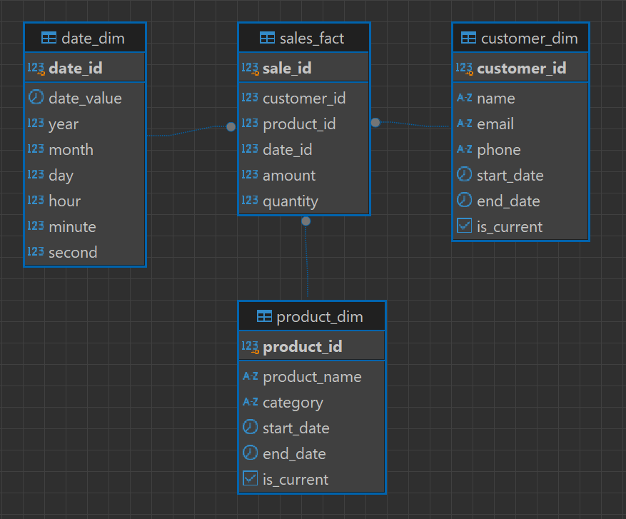
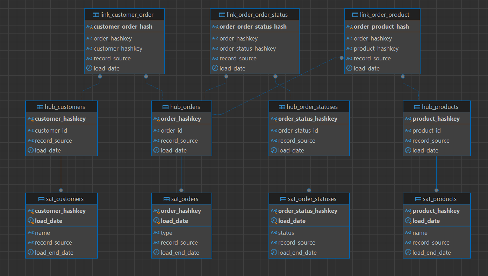

### Basic crud application for different types of storages and formats 

Contains only scripts with manual launch. 
No api exist.

### Installation
```
python -m venv .venv
source .venv/bin/activate
pip install --upgrade pip
pip install -e .
```

### Database

Database(pg postgres:17.5) is located in docker (port 10452). To launch database run
```
./start-database.sh
```
Database configuration 
```
./.env
```

### Project stucture

Project split on modules:
- week 3
  - library
- week 4
  - star
  - data_vault
  - partitions
- week 5
  - clickhouse
- week 6
  - s3_upload

Main execution scripts: 
```
python ./src/library/__main__.py
python ./src/data_warehouse/star/__main__.py
python ./src/data_warehouse/data_vault/__main__.py
python ./src/data_warehouse/partition/__main__.py
python ./src/clickhouse/__main__.py
python ./src/s3_upload/__main__.py
```

### Week 3. Data generation

> Modules generate data on start. 
> 
> Data might not be able to run twice due to constraints in database.

Sql scripts located in following directories:
- library
  - ./src/library/persistence/sql
- star
  - ./src/data_warehouse/star/sql
- data_vault
  - ./src/data_warehouse/data_vault/sql
- partition
  - ./src/data_warehouse/partition/sql


### Erd, week 4
Star:



Data vault:



### Clickhouse, week 5

Clickhouse (clickhouse:25.11.3.54-jammy) is located in docker (port 10453, 10454). To launch run
```
./start-clickhouse.sh
```
Clickhouse configuration 
```
./src/clickhouse/clickhouse.env
```

Clickhouse module presented as a flow in file ./src/clickhouse/log_analytic.py.

First created a table 'web_logs'. 
Then it populated with random data for 10mil rows.
Then different analytic queries are performed in 2 steps, before and after optimization.
Optimization for different query is different.

Execution log of the 'log_analytic.py' script will show exact statistic for queries, such as:
- exetution time
- consumed memory
- total retrieved rows
- total bytes

### Grafana, week 5

```
./start-grafana.sh
```
Gran configuration is in directory 
```
./grafana
```
Contains default user:
- login: admin
- password: admin

Contains preconfigured datasource for clickhouse on http://clickhouse:9000
Contains preconfigured dashboards:
- web_logs: custom with basic info about web_logs table
- ClickHouse - Data Analysis: default clickhouse configuration
- ClickHouse - Query Analysis: default clickhouse configuration


### S3, week 6

S3 provider is seaweedfs. Started in docker with s3 API on http://seaweedfs:8333 or http://localhost:10456
```
./start-s3.sh
```
Admin ui can be started with command:
```
docker-compose exec -d seaweedfs /usr/bin/weed admin
```
Admin ui will be available on http://seaweedfs:23646 or http://localhost:10457

s3_upload module does following:
- creates products tables in postgres
- populate few products
- load these products from postgres to s3 in bucket root as products.parquet
- load same products from postgres to s3 in bucket as Iceberg structure under iceberg_warehouse dir
- Result are described in ./src/s3/upload/results.txt

### Data build tool DBT, week 9
#### ports
Required ports on host:
- 10452 - postgres

#### setup, launch scripts:
Start required services:
```
./start-database.sh
```

DBT application executed in extra container:
```
./start-dbt-star.sh
```

#### dbt application description:
Application flow located in ```entrypoint_dbt_star.sh``` and performs few steps:
- initialize source tables: ```products, customers, sales``` from ```data/init-tables.sql```
- populate initial data from ```data/init-data.sql```
- Run dbt for snapshots and models
- updates data in source tables from ```data/update-data.sql```
- Run 2nd time dbt to update star model's data

DBT creates 5 objects in database:
- table: customers_snapshot
- table: products_snapshot
- table: sales_facts
- view: dim_customer
- view: dim_product

Snapshots are dbt provided functionality for SCD2 

