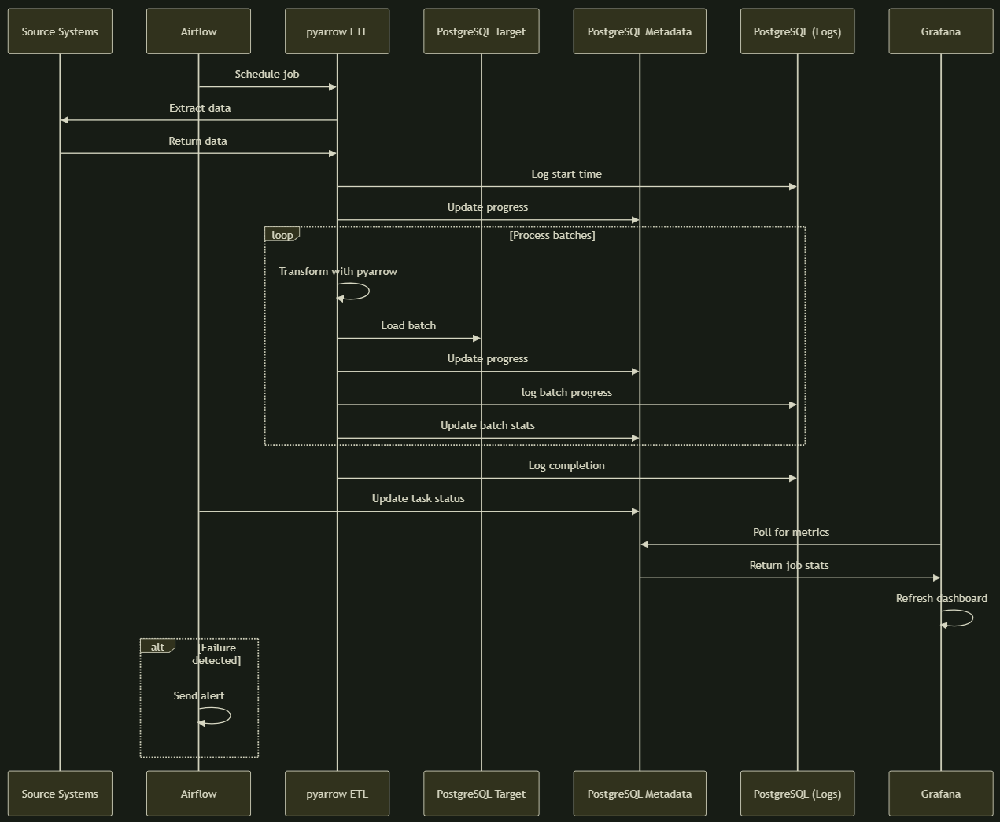

# ETL Solution Report

## 1. Overview

The company operates a custom Python-based ETL process that transfers data from multiple accounting systems into a centralized PostgreSQL database. While initially sufficient, the solution no longer scales due to increased data volume, number of sources, and operational expectations.

This document:

* analyzes the current ETL implementation,
* identifies concrete technical problems and their root causes,
* maps each problem to feasible solutions using the allowed toolset,
* estimates implementation effort,
* prepares the ground for proposing a revised ETL architecture.

## 2. Current Solution (As-Is)

### Description

* A standalone Python script performs extraction and loading.
* Source and target configuration (server, schema, table) are passed as runtime parameters.
* The same logic is reused across different data sources.
* Logs are written to files or standard output.
* Execution is triggered manually or by an external system.

### Observed Characteristics

* Single-process execution
* No centralized orchestration or scheduling
* No persistent execution metadata
* No structured logging
* No automated failure detection or notification
* No CI/CD or repeatable deployment process

## 3. Identified Problems and Root Causes

### 1. Memory Failures (ETL-001)

#### Cause 1: Full dataset materialized in memory

The ETL process loads entire tables or large result sets into memory before writing, causing out-of-memory failures on large tables.

| Solution / Tool | Effort | Requirement addressed | Notes |
| --- | --- | --- | --- |
| DB cursor + batching | 1 | ETL-001 | Server-side cursors with `fetchmany` keep memory usage flat              |
| pyarrow | 1–2 | ETL-001 | Columnar streaming with predictable memory behavior                      |
| pandas (chunksize) | 1–2 | ETL-001 | Works but higher per-batch memory overhead                               |
| Spark | 3–5 | ETL-001 | Technically solves the issue but adds unnecessary operational complexity |

---

#### Cause 2: Uncontrolled concurrent executions

Multiple ETL runs execute simultaneously, competing for memory and database resources without coordination.

| Solution / Tool | Effort | Requirement addressed | Notes |
| --- | --- | --- | --- |
| Airflow scheduler | 2–3 | ETL-001 | Controls parallelism via pools, queues, and task limits |

#### Cause 3: No incremental load strategy

All runs perform full-table scans even when only a small subset of data has changed.

| Solution / Tool | Effort | Requirement addressed | Notes |
| --- | --- | --- | --- |
| Incremental filters (`updated_at`, IDs) | 1 | ETL-001 | Reduces volume but still batch-based |
| CDC (Change Data Capture) | 2–4 | ETL-001 | Eliminates full scans by consuming change logs |

### 2. Slow Progress Visibility and Error Discovery (ETL-002)

#### Cause 1: Logs are unstructured

Free-text logs make it difficult to correlate messages with specific runs, sources, or tables.

| Solution / Tool | Effort | Requirement addressed | Notes |
| --- | --- | --- | --- |
| Structured logging in ETL code | 1 | ETL-002 | Include `run_id`, source, table, batch, timestamp, level |

#### Cause 2: Logs are not persisted as queryable data

File-based logs cannot be aggregated, filtered, or analyzed efficiently.

| Solution / Tool | Effort | Requirement addressed | Notes |
| --- | --- | --- | --- |
| Direct DB insertion (PostgreSQL) | 1–2 | ETL-002 | ETL writes structured logs to dedicated tables 
| ClickHouse | 2–3 | ETL-002 | Optional for very high log volumes|
| Log shipping agents | 1–2 | ETL-002 | Adds complexity without strong benefits at current scale |
| Message queue (Kafka) | 2–3 | ETL-002 | Decouples producers/consumers but premature here |

#### Cause 3: No execution metadata model

There is no persistent representation of ETL runs, task states, or durations.

| Solution / Tool | Effort | Requirement addressed | Notes |
| --- | --- | --- | --- |
| ETL run metadata tables (PostgreSQL) | 1 | ETL-002 | Store run status, timestamps, row counts, errors |

---

#### Cause 4: No aggregation or analysis layer

Even when logs exist, there is no mechanism to summarize progress or detect anomalies.

| Solution / Tool | Effort | Requirement addressed | Notes |
| --- | --- | --- | --- |
| SQL views / queries | 1 | ETL-002 | Aggregate failures, durations, throughput              |
| Grafana dashboards | 1 | ETL-002 | Visual monitoring of ETL health                        |
| Airflow scheduled checks | 1 | ETL-002 | Periodically execute analytical SQL and act on results |

> Note: Airflow is used only for scheduling checks, not for performing aggregation or analysis itself.

### 3. Automatic Notifications (ETL-003)

#### Cause 1: No explicit failure detection logic

Failures are only visible by manually inspecting logs.

| Solution / Tool | Effort | Requirement addressed | Notes |
| --- | --- | --- | --- |
| Airflow task callbacks | 1 | ETL-003 | Trigger notifications on task failure with full context |

## 4. Missing Data Quality Validation (Optional)

#### Cause 1: No basic volume or null checks

Incorrect loads may succeed technically but contain bad data.

| Solution / Tool | Effort | Requirement addressed | Notes |
| --- | --- | --- | --- |
| Row count comparisons | 1 | Optional | Compare source vs target volumes |
| Null-rate checks | 1 | Optional | Validate key columns |

#### Cause 2: Schema drift not detected

Source schema changes may break downstream assumptions.

| Solution / Tool | Effort | Requirement addressed | Notes |
| --- | --- | --- | --- |
| Schema hash comparison | 1 | Optional | Detect changes early |
| Iceberg | 1–2 | Optional | Heavyweight; only justified for frequent schema evolution |

#### Cause 3: Missing or duplicated records

Partial failures may go unnoticed.

| Solution / Tool | Effort | Requirement addressed | Notes |
| --- | --- | --- | --- |
| Metadata comparison scripts | 1–2 | Optional | Compare PK ranges, timestamps, counts |

## Component selection (Low Resources). Prefered. Main choice.

Components are selected based on their:
- resource requirements (lowest)
- effort of setup and maitanance (lowest)
- scalability
- performance
- amount of problems it can solve

Based on data from cause sections the following components are selected:

| Solution / Tool | Effort | Requirement addressed | Notes |
| --- | --- | --- | --- |
| pyarrow | 1-2 | Memory Failures (ETL-001) | Best performance / safest memory |
| airflow | 1-3 | Memory Failures (ETL-001), Slow Progress Visibility (ETL-002), Automatic Notifications (ETL-003)  | task scheduling, concurrency control, failure handling, data quality tasks, notifications |
| PostgreSql | 1 | Slow Progress Visibility and Error Discovery (ETL-002) | Already in stack, structured logging + execution metadata |
| Grafana | 2 | Slow Progress Visibility and Error Discovery (ETL-002) | dashboards |

## New architecture benefits:
#### Parallel Processing:
   Airflow:
   - Concurrent task execution
   - Task scheduling and queueing
   - Isolated source processing

#### Memory Management:
   pyarrow:
   - Batched processing (fixed memory footprint)
   - Streaming capabilities
   - Columnar efficiency

#### Volume Growth Handling:
   - Processing time scales with batches
   - Memory usage remains constant
   - Automatic recovery mechanisms

#### Data quality testing:
   Airflow:
   - Scheduled validation tasks
   - Pre/post-load checks
   - Automated alerts

#### Progress and error monitoring:
   Grafana:
   - Real-time quality dashboards
   - Historical execution metadata, logs, metrics
   Airflow:
   - notifications for fail / success task results

## Risks
| Risk | Impact | Probability | Mitigation Strategy |
| --- | --- | --- | --- |
| PostgreSQL heavy load | Medium | Low | Separate metadata/log databases,  Index optimization, Partition large tables, Implement retention policies |
| Integration Failures | High | Medium | Comprehensive testing, Staged rollout, Rollback procedures |
| Single Point of Failure (Airflow) | High | Low | Implement health checks and auto-restart, Maintain manual fallback scripts, Use Airflow High Availability mode |

## Alternative Component Selection (Higher Resources).

Heavy maitenance, scalability, learning curve. Recommended for heavy load.

| Component | Category | Effort |  Why It's Better | Key Benefits |
|-----------|----------|-----------------|--------|--------------|
| Apache Spark (Structured Streaming) | Execution Engine | 4-5 | Handles massive datasets, built-in fault tolerance, parallel processing | Scales horizontally, supports complex transformations, has built-in connectors |
| Kubernetes | Orchestration | 3-4 | Containerized execution, better resource isolation, dynamic scaling | scales workers on demand, better resource utilization |
| Debezium + Kafka Connect | Data Ingestion | 2-3 | Real-time CDC, schema evolution handling, exactly-once semantics | Near real-time data, handles schema changes gracefully, robust delivery guarantees |
| ClickHouse | Log/Metrics Storage | 1-2 | Columnar storage optimized for analytics, sub-second queries | Handles high-volume logging, enables complex ad-hoc queries on logs |
| dbt | Data Quality & Transformation | 1-2 | Declarative data quality, version-controlled tests, documentation | Production-grade data quality framework, reusable validation patterns |
| Kafka | Streaming Platform | 3-5 | Enterprise-grade Kafka with Schema Registry, KSQL, Connect | Full streaming ecosystem, schema management, stream processing |